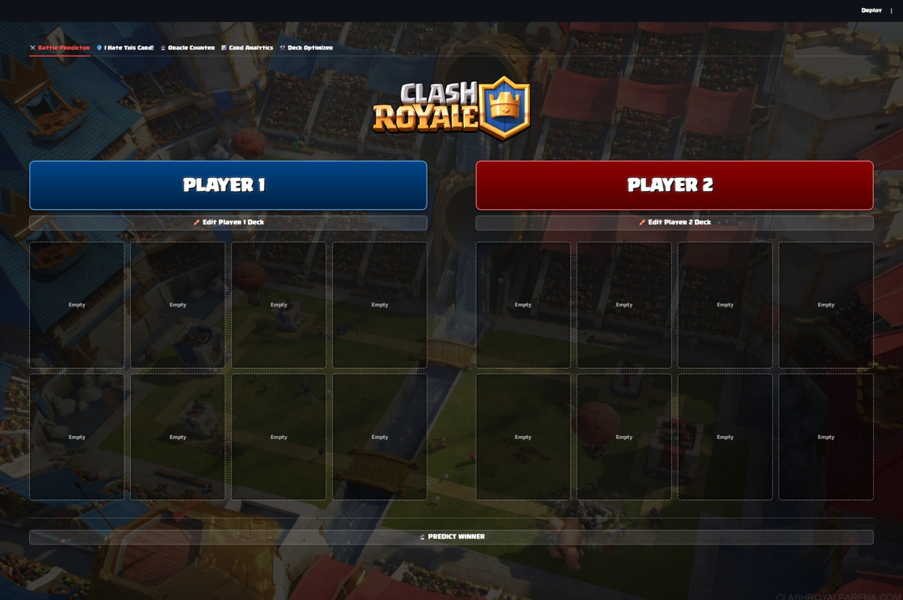
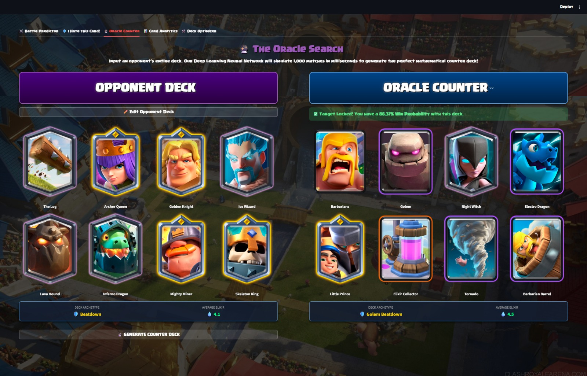
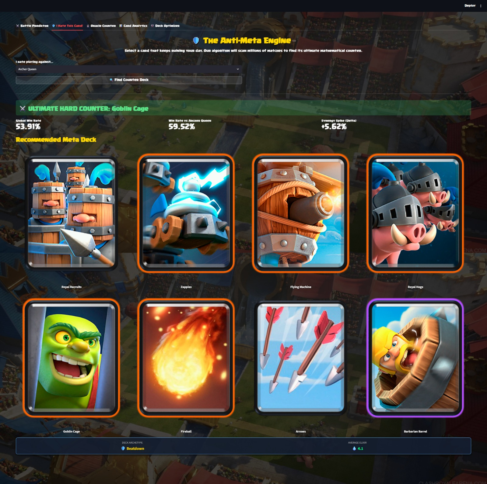
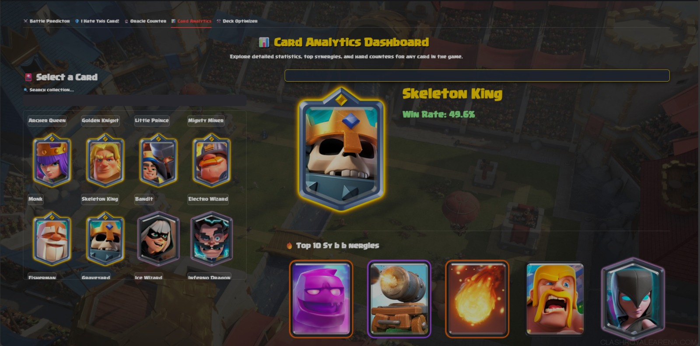
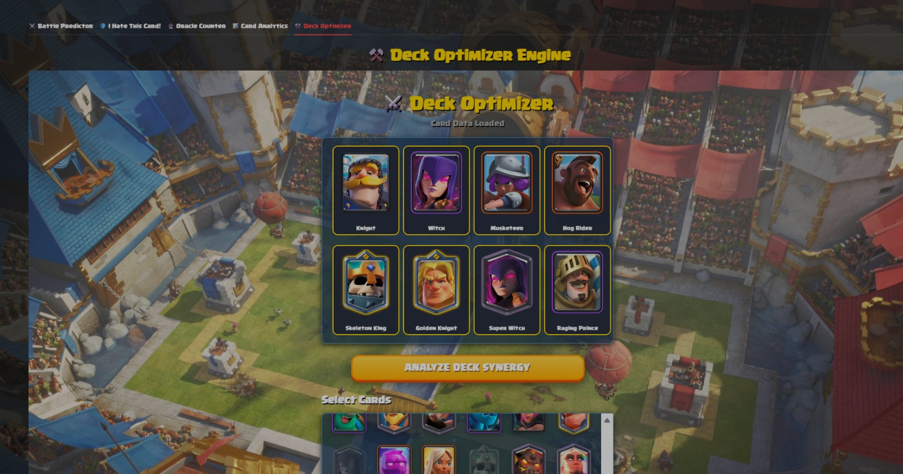

# 👑 Clash Royale AI: Intelligent Deck Evaluation System


*(Drop a cool banner image here!)*

## 📖 Overview
The arena gates open. Two kings stand on opposite sides of the battlefield. Towers are loaded, elixir is ticking, and eight cards define everything that follows. In Clash Royale, victory is rarely decided by reaction speed alone. At the highest levels of play, deck composition, card synergies, and meta awareness determine the outcome long before the first card is placed.

This project is an advanced Machine Learning-powered deck evaluation system built for the **CSES NOOBATHON** hackathon (**Track 1: Clash Royale**). It is designed to simulate how a meta-aware competitive player evaluates matchups using pure data. By analyzing historical match data, this application predicts win probabilities, generates ultimate counter-decks, and visualizes deep card synergies.

---

## ✨ Key Features & "Brownie Points" Achieved

This application was meticulously crafted to hit all the Technical Deliverables and Brownie Points outlined in the problem statement.

### 1. ⚔️ Battle Predictor (Core Objective)
Design and train a Machine Learning model that, given two Clash Royale decks, predicts which deck is more likely to win.
* **Feature Engineering:** Automatically calculates **Average Elixir Cost** and identifies **Archetype indicators** (e.g., Beatdown, Cycle, Control, Siege) for both decks.
* **Prediction:** Outputs the exact win probability between Player 1 and Player 2.



### 2. 🔮 The Oracle Search (Counter-Deck Recommendation)
*Brownie Point #1 Achieved*
Given a single opponent deck, this Deep Learning Neural Network simulates 1,000 meta-matchups in milliseconds to generate the ultimate counter deck that maximizes the chances of winning. It showcases a deep understanding of strategic deck construction.



### 3. 🛡️ The Anti-Meta Engine ("I Hate This Card!")
*Brownie Point #1 & #2 Achieved*
Users can input a specific card they struggle against. The algorithm scans millions of rows of data to find the mathematical hard counter to that specific card and recommends a highly synergistic meta deck containing it.



### 4. 📊 Card Analytics Dashboard
*Brownie Point #2 Achieved*
A comprehensive dashboard providing insights on individual cards.
* Displays global **Win Rates**.
* Visualizes the top 10 **Synergy matrices** and **Hard Counters** using intuitive graphical bars.



### 5. ⚒️ Interactive Deck Optimizer
*Brownie Point #3 Achieved*
A sleek, modern UI built with Streamlit and custom HTML/CSS for smooth model integration. It features an interactive drag-and-drop style builder that calculates the weakest link in a deck and suggests the mathematically perfect replacement card based on synergy scores.



---

## 🧠 Technical Architecture & Data Strategy

* **Model Development:** Utilizes a custom Deep Learning Neural Network (TensorFlow/Keras) to predict match outcomes, ensuring generalization to unseen matchups.
* **Deck Representation:** Decks are encoded using binary vectors (card presence), mapped to multi-dimensional tensors for the Neural Network.
* **Data Strategy:** Models are trained to recognize proper train-test splits to avoid data leakage, focusing heavily on recent competitive patterns to reflect the current meta, rather than blindly fitting outdated historical data.
* **Frontend:** Built completely in Python using **Streamlit** for a smooth, interactive End-to-End User Experience.

---

## 🚀 Installation & Setup

Want to run this locally? Follow these steps:

1. **Clone the repository:**
   ```bash
   git clone [https://github.com/yourusername/clash-royale-ai.git](https://github.com/yourusername/clash-royale-ai.git)
   cd clash-royale-ai

2. **Install Dependencies:**
    ``` 
    pip install requirements.txt

3. **Run the Application:**
    ```
    streamlit run app.py
